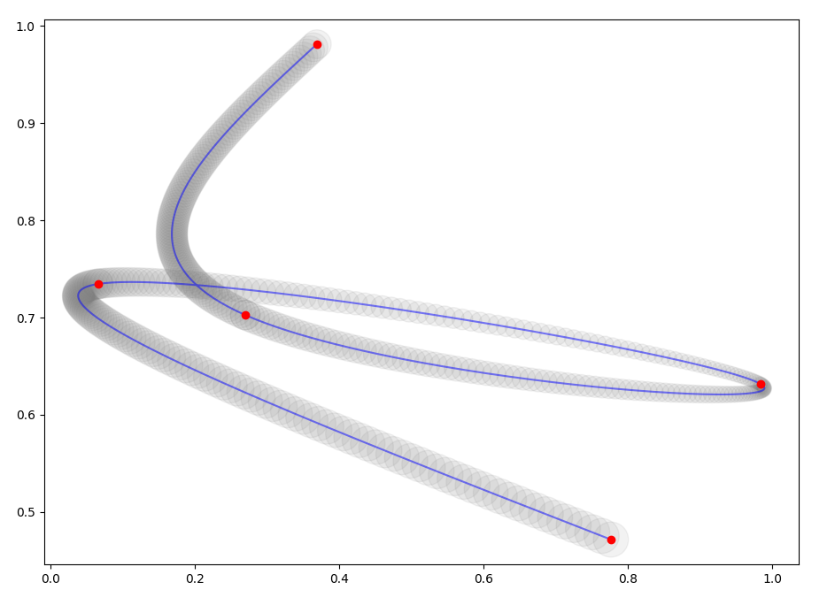

ZOOM & SLIDE
============

MWP простейшей анимации изображения по траектории
-------------------------------------------------

- main.py - генератор анимационного raw потокa
- interpolation_test.py - визуализация траектории
- bezier.py - интерполятор точек
- play.sh - проигрыватель raw потока
- record.sh - запись потока в mp4

Зависимости
-----------

- numpy
- PIL
- ffmpeg
